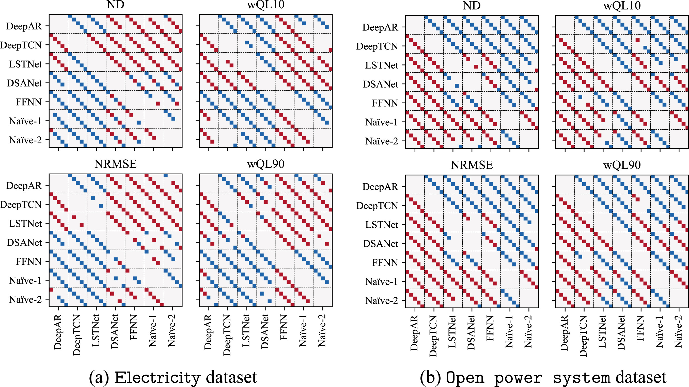
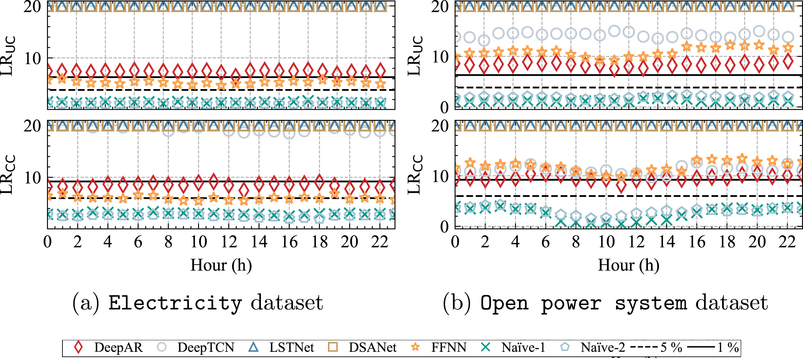

# Multivariate Deep Learning

<!--toc-->
## Contents
- [Manuscript](#manuscript)
- [Datasets](#datasets)
  - [Electricity](#electricity)
  - [Open power system](#open power system)
- [Results](#results)
- [Source code](#source code)
- [Authors](#authors)
<!--toc_end-->


## Manuscript

This repository contains the source code utilized for the following paper:
```
@article{mashlakov2021assessing,
  title={Assessing the performance of deep learning models for multivariate probabilistic energy forecasting},
  author={Mashlakov, Aleksei and Kuronen, Toni and Lensu, Lasse and Kaarna, Arto and Honkapuro, Samuli},
  journal={Applied Energy},
  volume={285},
  number={},
  pages={},
  year={2021},
  publisher={Elsevier},
  doi={https://doi.org/10.1016/j.apenergy.2020.116405}
}
```
Please cite the following paper if you find the dataset or modified source code helpful for your research.

## Datasets

The datasets are located under [datasets](datasets) folder. To run the codes, please unzip and move the datasets in the corresponding data folder of the model repository.
> Example.

```
$ cd datasets/csv
$ gzip -dk europe_power_system.csv.gz
$ mv europe_power_system.csv.gz DeepAR/data/elect
```
> Warning. Use the following format for the models:
```
.csv for DeepAR -> DeepAR/data/elect
.csv for DeepTCN -> DeepTCN/electricity/NewTCNQuantile/data
.txt for LSTNet -> LSTNet/data
.txt for DSANet -> DSANet/data/electricity or DSANet/data/europe_power_system
```

> ### Electricity consumption

The electricity dataset is taken from https://github.com/laiguokun/multivariate-time-series-data :

"The raw dataset is in https://archive.ics.uci.edu/ml/datasets/ElectricityLoadDiagrams20112014. It is the electricity consumption in kWh was recorded every 15 minutes from 2011 to 2014. Because the some dimensions are equal to 0. So we eliminate the records in 2011. Final we get data contains electircity consumption of 321 clients from 2012 to 2014. And we converted the data to reflect hourly consumption."

> ### Open power system

The open power system dataset is retrieved from a [free and open platform for power system modeling](https://open-power-system-data.org/).
The dataset corresponds to [Time Series data package](https://data.open-power-system-data.org/time_series/2019-06-05) with the [following documentation](https://nbviewer.jupyter.org/github/Open-Power-System-Data/datapackage_timeseries/blob/2019-05-15/main.ipynb).

The dataset represents the data originating from the European market bidding zones. This dataset contains a diverse mix of time series namely electricity consumption, market prices, wind and solar power generation with hourly resolution.
The initial dataset was preprocessed by removing the capacity and profile data, as well as series whose percentage of missing values exceeds 5\% for the defined time period. It was also limited in time for the period from January 2015 to November 2017. As a result, the data consists of 183 variables where 59 are related to load, 31 to price, 57 to wind and 36 to solar.

## Results
Results of the conducted one-sided Diebold–Mariano tests at the 5% significance levels on the electricity (a) and open power system (b) datasets for point accuracy (ND and NRMSE) and quantile risk (wQL) of 0.1 and 0.9 quantiles per particular (from left to right by diagonal: 3, 6, 12, 24, and 36 h) horizons. A red (blue) square indicates that the forecasts of a model on the -axis are significantly better (worse) than the forecasts of a model on the -axis for a particular horizon, whereas an absence of square indicates that the forecasts are not significantly different for a particular horizon.



Results of the Christoffersen tests on unconditional and conditional LR statistics for the electricity (a) and open power system (b) datasets. The statistics is obtained for day-ahead (36 h ahead) forecast of 80% prediction interval (PI) separately for each 24 h of the next day. The solid (dashed) horizontal lines represent the 1% (5%) significance level of the appropriate distribution. All the test values exceeding 20 are set to 20.



## Source code

The code used for the experiments was heavily based on open source projects listed below and modified for the needs of experiments. You can find the description of the modifications in the corresponding model folders.

- [DSANet](DSANet) was modified from https://github.com/bighuang624/DSANet
- [DeepAR](DeepAR) was modified from https://github.com/zhykoties/TimeSeries
- [LSTNet](LSTNet) was modified from https://github.com/fbadine/LSTNet
- [DeepTCN](DeepTCN) was modified from https://github.com/oneday88/deepTCN/tree/master/electricity

## Authors

The modifications are done by:

* **Aleksei Mashlakov** (<aleksei.mashlakov@lut.fi>) - *LUT University, Finland*

* **Toni Kuronen** (<toni.kuronen@lut.fi>) - *LUT University, Finland*
